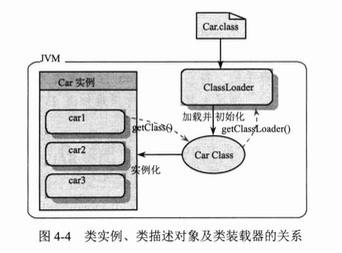

# 装配bean

## 自动化装配bean

**自动装配是让Spring自动满足bean依赖的一种方法 **

 # Ioc

## ClassLoader

classloader负责在运行时查找和装入class字节码文件，JVM运行时产生3个ClassLoader，三者之间存在父子层级关系。在默认情况下，使用AppClassLoader装载应用程序的类

+ 根装载器：C++编写，java中看不到，返回null，负责装载jre目标下的jar

+ ExtClassLoader：负责装载JRE扩展目录ext中的jar

+ AppClassLoader：装载Classpath路径下的类包

**全盘负责委托机制**：全盘负责表示一个类被当前ClassLoader装载的话，该类的所有引用和依赖将都会被该ClassLoader装载；委托机制表示先委托父装载器寻找，找不到的情况才会从自己的路径中查找并装载目标类

## 反射机制

Class反射对象描述类语义结构，可从Class对象中获取构造函数、成员变量、方法等类元素的反射对象，通过反射机制，可以绕过不能访问私有变量的限制，`field.setAccessible(true)`

ClassLoader装载class字节码文件到JVM中，拿到对象，然后利用反射机制，通过反射该对象来描述类的语义结构

+ Constructor：类的构造方法反射类
+ Method：类方法的反射类
+ Field：类的成员变量的反射类 

返回值均为数组